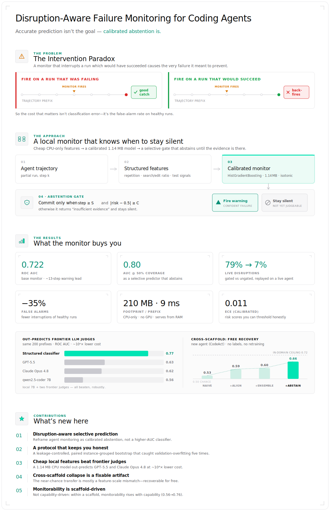
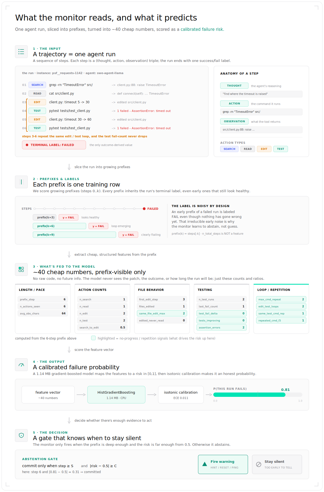

# Hold Your Fire: Disruption-Aware Failure Monitoring for Coding Agents

A local, CPU-only monitor that spots failing coding-agent runs early and knows when to stay quiet.

<p align="center">
  
</p>

Coding agents (SWE-agent, OpenHands, and similar) work on their own over long runs:
reading files, editing code, running tests. Many of those runs fail, and they usually
show it well before the end, looping on a broken command, or editing the same few lines
again and again while the tests never improve.

**Hold Your Fire watches a run as it happens, reads the partial trajectory, and predicts when
it's drifting toward failure**, early enough to step in (a hint, a reset, a nudge) and
stop wasting compute. It runs entirely on a laptop with local open-source models through
**Ollama**: no GPU, no paid APIs, no cloud.

The catch (and the whole point) is that a monitor which interrupts a run that *would have
succeeded* **causes** the very failure it was trying to prevent. So Hold Your Fire is built to
**stay quiet when the evidence isn't there yet**, and speak up only when it's confident.
Interrupting far less often is the better trade.

## How it works

1. **Cheap signals.** It turns the partial run into a handful of cheap, structured features:
   repetition, how much the agent is searching vs. editing, whether it's running tests, and so on.
2. **A tiny calibrated model.** A 1.14 MB gradient-boosted model scores failure risk, with
   calibrated probabilities you can actually set a threshold on.
3. **An abstention gate.** It only commits to a verdict once there's enough evidence (far enough
   into the run *and* confident enough). Otherwise it answers "not sure yet" and stays silent.

Concretely, here is one real run flowing through the whole pipeline: a trajectory of
(thought, action, observation) steps, sliced into prefixes, turned into the actual features
the model reads, scored into a calibrated risk, and gated into a verdict.

<p align="center">
  
</p>

## Results

All numbers are on a held-out test set and measured honestly: no data leakage, and runs are
split by task so the model is never tested on something it trained on.

- **Predicts failure early:** about **13 steps** before a run ends (ROC AUC **0.722**), and the
  risk scores are **well-calibrated** (ECE 0.011).
- **Knows when to stay quiet:** used as a "speak only when sure" monitor, accuracy climbs to
  **0.80 while still covering half the runs**.
- **Stops crying wolf:** on a live agent it cuts needless interruptions of healthy runs from
  **79% down to 7%**, and trims false alarms on successful runs by about **35%**.
- **Beats much bigger LLM judges:** a 1 MB model on CPU out-predicts **GPT-5.5** and
  **Claude Opus 4.8** as failure judges (0.77 vs. ~0.62 to 0.63) at roughly **10,000× lower cost**.
- **Moves to new agents, mostly for free:** pointed at a different agent style (OpenHands/CodeAct)
  with no retraining, accuracy drops at first, but a few free, label-free fixes recover most of it
  (0.53 to 0.66).

The full write-up, every experiment, and the honest negative results are in the paper:
**[`paper/paper_draft.md`](paper/paper_draft.md)** (compiled PDF at `paper/main.pdf`).

## What the model looks like inside

Beyond the monitor, a white-box study ([`mech_interp/`](mech_interp/)) asks *why* agents loop.
We read a 1.5B coding model's internal state at a decision point and map it to 2D. Three things an
agent can be doing land in three separate regions: **going in circles** (re-running the same failing
command), **busy but stuck** (different commands that all keep failing), and **making progress**. So
"stuck" is a real, readable state, not confusion. And it is not a small-model quirk: re-running the
same battery on Qwen2.5-Coder from **0.5B to 14B**, the loop-vs-churn signal stays decodable at
ceiling (length-controlled) at every size.

<p align="center">
  
</p>

That separation is what the rest of the work builds on. Because "stuck" has its own region, a
1.14 MB monitor can flag a failing run early, from the trajectory alone. On this small model,
nudging a looping run toward the "progress" region breaks **100%** of audited loops. The honest
split: the readable "stuck" representation holds across the whole family (0.5B to 14B), but the
steering lever stays small-model. A capable 30B has **no** steerable rut; its failures are
competence, not a loop, so there the win comes from *selecting* among outputs, not steering. Full
details are in the paper (§4.9 to §4.10).

You can see that family-wide result directly: every model from **0.5B to 14B** sorts the three
behaviors into three separate clusters at the layer where they separate most sharply.

<p align="center">
  
</p>

## Install

```bash
# 1) local models (one-time)
brew install ollama && ollama serve
ollama pull qwen2.5-coder:7b
ollama pull qwen2.5-coder:14b      # optional, secondary model

# 2) python env
make setup            # creates .venv and installs the package (editable)
make system-check     # verifies Ollama, model, deps, no paid keys needed
```

You can also run any script without installing, using the bundled bootstrap:
`PYTHONPATH=src python3 scripts/<name>.py ...`.

## Run it yourself

```bash
# Offline (the core, CPU-only result)
make data-full                                 # download Nebius corpus (~1.1GB)
python scripts/build_prefix_dataset.py --input full \
    --max-fail-per-instance 2 --max-success-per-instance 12 \
    --output data/processed/prefix_offline_full.parquet
make train-full && make eval-full              # train 7 models + 9 ablations, evaluate
make report                                    # tables + figures from saved results

# Local LLM judge baseline (real Ollama inference)
make ollama-judge-small

# Frontier LLM judge baselines (the only paid step; same 200 prefixes, same prompt and seed)
export OPENAI_API_KEY=...                      # GPT-5.5
python scripts/run_openai_judge_subset.py --n 200 --reasoning-effort low
export OPENROUTER_API_KEY=...                  # Claude Opus 4.8 via OpenRouter
python scripts/run_openai_judge_subset.py --n 200 --backend openrouter \
    --model anthropic/claude-opus-4.8
# ...or verify for $0: the raw judge outputs (scores, latency, AUC) are committed
# under results/offline/small/gpt_judge*.json and ollama_judge.json

# Online (local mini-SWE-agent + Ollama)
make mini-smoke                                # quick smoke test
make online-shadow-small                       # baseline vs. shadow (behavior-identical)
make online-loop-guard-small                   # intervention + recovery/disruption

# Qualitative audit + tests
python scripts/audit_prefixes.py --kind true_positive --n 50
make test
```

## Runs fully local, by design

- Inference is local through **Ollama** only: no paid or cloud providers, no remote inference.
- **No GPU** and **no fine-tuning**: classical ML on CPU.
- Evaluation is **leakage-controlled**: no future information in the features, and runs are split
  by task (`instance_id`), never by individual prefix.
- Every expensive step has a fast smoke-test mode, and everything reproduces from CLI scripts.

## Project layout

```
src/localguard/    schemas, ingest, normalize, action_parser, prefix_builder,
                   features, split, train, evaluate, calibrate, thresholding,
                   monitor, interventions, ollama_judge, mini_swe_wrapper,
                   online_runner, git_checkpoints, toy_tasks, reporting, utils
scripts/           system_check, download_data, inspect_dataset_schema,
                   build_prefix_dataset, train_monitor, evaluate_monitor,
                   run_ollama_judge_subset, run_mini_swe_shadow,
                   run_mini_swe_intervention, audit_prefixes, make_report
configs/           offline_{small,full}, online_*, mini_swe_ollama_*
tests/             no-leakage, group-split, action-parser, prefix-builder,
                   features, thresholding, interventions  (42 tests)
paper/             paper_draft.md, main.pdf, experiment_log.md, results_*.md
results/           offline/, online/, figures/, tables/, audits/
```

## Good to know

- Labels are **final outcomes** attached to partial runs (a noisy "will this eventually fail?"
  signal), not per-step correctness.
- The training benchmark is balanced so there's a learnable signal; the natural failure rate
  (0.833) is reported separately.
- Live-agent results are small-scale and illustrative; no headline claim rests on them.
- Hold Your Fire isn't the first system to predict agent failures; the paper covers prior work.

## License

MIT.
