# Hold Your Fire: Disruption-Aware Failure Monitoring for Coding Agents

---

## Abstract

Coding agents fail mid-trajectory by looping on a broken command, churning edits whose tests
never improve, or drifting from the bug. A monitor that predicts failure from a partial
trajectory could intervene early, but intervention is double-edged: interrupting a run that
would have succeeded causes the very failure it was meant to prevent, a tension we call the
Intervention Paradox. Studying local, CPU-only monitors for SWE-agent trajectories, we reach
one thesis: accurate prediction is not the goal; calibrated abstention is. On 127k
leakage-controlled prefix examples, a 1.14 MB monitor predicts terminal failure at ROC AUC
0.722 with a roughly 13-step lead, bounded by an irreducible early floor we characterize rather
than chase. Recast as a selective predictor that abstains on prefixes it cannot yet judge, it
cuts false alarms on successful runs by 35%, and on a live agent it cuts disruptive
interventions from 79% to 7%, at a fraction of the cost of the local and frontier LLM judges it
out-predicts. A paired held-out bootstrap caught validation overfitting five times, so we trust our negative
results as much as the positive ones, including that cross-scaffold collapse is a recoverable
feature-scale artifact and that monitorability tracks the agent's action space, not its
capability. A white-box follow-up on a 30B model and real, contamination-free tasks sharpens the
thesis: a penalty targeted at the repeated command breaks 100% of audited loops, yet on a capable
model every eager intervention fails, with no steerable recovery direction, a "reconsider" nudge
that lowers the solve rate, and gains that come from selection rather than steering. From the
intervention side as from the monitoring side, the value lies in restraint.

---

## 1. Introduction

LLM coding agents (SWE-agent, mini-SWE-agent, OpenHands, and similar) operate
autonomously over long tool-use trajectories: reading files, editing code, running
tests. Many of those trajectories end in failure, and they often telegraph it long
before the end: an agent re-runs an identical failing command, or edits the same five
lines again and again while the test output never changes. A *monitor* that reads the
trajectory prefix and flags impending failure could trigger a cheap corrective
intervention (a hint, a reset, a human ping) and save wasted compute.

The catch is the **Intervention Paradox**: a monitor that fires on a run which was
actually going to succeed *disrupts* it. For a disruption-aware monitor the operative
cost is therefore not classification error but the **false-alarm rate on successful
runs**, traded against coverage of real failures and the lead time of the warning.

This framing changes what "good" means, and it drives our central finding. We can
predict failure only *moderately* well from a partial trajectory, and, crucially, that
ceiling is **real, not a modeling deficiency**: a prefix taken ten steps into a run that
eventually fails is frequently indistinguishable from a healthy prefix, because the run
had not yet gone wrong. No amount of model capacity recovers a signal that is not yet
present. The right response is not a better classifier but a monitor that **abstains**
on prefixes it cannot yet judge and commits only when the evidence is there.

Where prior agent and reasoning monitors optimize predictive *accuracy* (process reward
models, step verifiers, prefix critics; see Related Work), we are (to our knowledge) the
first to frame trajectory monitoring as **disruption-aware selective prediction**, to pair it
with a **leakage-controlled evaluation protocol** that a candidate must survive on a paired,
instance-grouped held-out bootstrap, and to characterize **when** behavioral monitoring works,
across model scale, agent action space, and *prediction time* (post-hoc acceptance ≫ early
warning). Everything runs locally on CPU; the only paid component is the LLM-judge baseline.

**Contributions.**
1. A local, CPU-only failure monitor for SWE-agent trajectories with honest,
   leakage-controlled performance (AUC 0.722, calibrated, ~13-step lead), and a
   characterization of *why* that number is a ceiling (§4.1, §4.6).
2. **Selective prediction (abstention) as the deployable form** of the monitor:
   AUC 0.80 @ 50% coverage, 35% fewer false alarms on successful runs, with a
   risk-coverage curve and a deployable step-gate (§4.3).
3. A **cross-scaffold generalization study** (second independent source, OpenHands/CodeAct):
   naive zero-shot collapses to near-chance (0.53), but **three free, label-free fixes recover
   it** (unsupervised feature-distribution alignment (0.59, ≈ the in-domain ceiling), an
   ensemble of transferable submodels (0.60), and abstention (0.66)): the collapse is mostly a
   feature-*scale* artifact, not absent signal; a *post-hoc acceptance* use transfers fully
   (0.72) (§4.4).
4. A controlled finding that **behavioral monitorability is governed by the agent's *action
   space*, not its capability**: at matched data budget, within a scaffold monitorability
   *rises* with capability (0.56→0.76), while a structurally different action space (CodeAct) is
   intrinsically less monitorable regardless, refuting a "capable agents fail invisibly"
   reading (§4.8, Fig 10).
5. **Online validation** on a live local agent showing abstention cuts disruptive
   interventions 79% → 7% on the same runs (§4.5).
6. A **human-validated** account of which failures are catchable early (§4.7), measured
   deployment cost, and a baseline study showing cheap structured features **out-predict
   local *and* frontier LLM judges** (GPT-5.5, Claude Opus 4.8) at ~1/10,000th the cost (§4.2).
7. The **evaluation protocol itself** (a paired instance-grouped held-out bootstrap)
   surfaced as a methodological contribution that repeatedly caught mirages (§5).
8. A **mechanistic, low-disruption intervention for the dominant failure mode (loops)**: a
   white-box study localizes looping to a causally-steerable layer-8 axis, then shows that the
   deployable fix is a **monitor-gated, *targeted* penalty on the specific repeated command**:
   it breaks 100% of audited real loops at near-zero disruption, where generic repetition
   penalties and circuit ablation fail. We carry the honest negative too: breaking the loop does
   not by itself flip outcomes at 1.5B, which sets up the decisive capable-model experiment we
   then run (§4.9, §4.10).
9. A **demonstration of the Intervention Paradox on a capable model and real hard tasks** (§4.10):
   scaling white-box steering to a 30B MoE (on-device) and running an agentic loop over
   contamination-free LiveCodeBench, we find a capable model has **no steerable recovery direction**
   (its failures are competence, not a behavioral pathology), an eager "reconsider" nudge measurably
   *lowers* the solve rate (5/21 → 2/21), and the only outcome gain comes from **selection**
   (execution-grounded sample-and-vote, 0.55 → 0.88), closing the paper's outcome-flip question from
   the intervention side: a monitor's value is restraint, not action.

---

## Related work

**Coding agents and benchmarks.** SWE-bench [Jimenez et al., 2024] established resolved/
unresolved grading on real GitHub issues; SWE-agent [Yang et al., 2024] and OpenHands
[Wang et al., 2024] are widely-used scaffolds with very different action spaces (a shell-
command interface vs. CodeAct function-calling). We monitor trajectories from both; our
second-source study (§4.4) deliberately spans these two action spaces, and the public
Nebius SWE-agent corpus supplies our training trajectories.

**Monitoring agent/reasoning trajectories (process supervision).** Most prior work scores
intermediate steps to *improve* task success: process reward models and step verifiers
[Lightman et al., 2023], outcome vs. process supervision, trajectory critics, and prefix-
based failure predictors. These optimize predictive accuracy. We
differ in *objective*: we treat monitoring as a **disruption-aware decision** in which the
dominant cost is a false alarm on a *healthy* run (the Intervention Paradox), and show the
deployable form is selective prediction, not a higher-AUC classifier.

**Selective prediction and the reject option.** Classification with a reject option
[Chow, 1970], selective classification and risk-coverage analysis [El-Yaniv & Wiener, 2010;
Geifman & El-Yaniv, 2017], and learning-to-defer [Madras et al., 2018; Mozannar & Sontag,
2020]. We bring this lens to agent monitoring (the first time to our knowledge), with a
deployable *prefix-visible* abstention gate and a risk-coverage curve rather than a single
operating point.

**Confidence calibration.** Temperature scaling and reliability diagrams [Guo et al., 2017];
isotonic / Platt calibration [Zadrozny & Elkan, 2002]. Calibration is central both to our gate
and to our cross-distribution finding: the monitor's *ranking* transfers while its
*probabilities* are target-specific and cheaply recalibrated.

**Distribution shift and domain adaptation.** Covariate-shift importance weighting
[Shimodaira, 2000] and correlation alignment (CORAL) [Sun et al., 2016]. Our cross-scaffold
study uses unsupervised feature-distribution (quantile) alignment, shows the naive transfer
collapse is largely a feature-*scale* artifact, and reports which DA techniques do and do not
help on this task.

**LLM-as-a-judge.** Using strong LLMs to evaluate outputs [Zheng et al., 2023]. We include
local (qwen2.5-coder) and frontier (GPT-5.5, Claude Opus 4.8) judges as baselines; a 1 MB
structured classifier *significantly out-predicts all of them* here at ~10⁴× lower cost: a
caution for LLM-judge-based monitoring.

**Positioning / what is new.** Closest to us are prefix-based agent failure predictors; we
depart by (i) reframing the task as **disruption-aware selective prediction**, (ii)
foregrounding a **leakage-controlled paired-bootstrap protocol** that repeatedly caught
validation-overfitting, and (iii) characterizing **when** behavioral monitoring works, across
model scale (it *helps*), action-space/scaffold (the dominant factor, recoverable by free
alignment), and prediction time (post-hoc acceptance ≫ early warning).

## 2. Problem setup and data

**Trajectories.** We use the public Nebius `SWE-agent-trajectories` corpus: 80,036
trajectories over 3,591 GitHub issue instances, generated by three model families
(swe-agent-llama 70b / 8b / 405b). Each trajectory is a sequence of (thought, action,
observation) steps with a terminal success/failure label.

**Prefixes and labels.** From each trajectory we emit *prefix* examples at increasing
step counts; a prefix's label is the trajectory's **terminal outcome**. This is the
honest but deliberately noisy setup: an early prefix of an eventually-failed run is
labeled "fail" even though nothing has gone wrong yet. We treat that label noise as a
first-class object of study rather than hiding it; it is the source of the early floor.
The corpus yields **127,092 prefix examples**.

**Splitting and leakage control.** All splits are **grouped by `instance_id`** (a repo
issue), never by prefix row, so prefixes of the same trajectory (and the same underlying
task) never straddle train/test. Split sizes: 81,070 / 20,856 / 25,166 prefix rows over
2,297 / 575 / 719 instances (train / val / test); failure base rate ≈ 0.57. We never
expose post-hoc fields (the gold patch, eval logs, exit status, future observations).
A **shuffled-label control** gives AUC 0.522, confirming the signal is not leakage.
Thresholds and any model selection are done on validation; test is scored **once**.

---

## 3. Method

**Features.** Cheap, structured, prefix-visible signals only, in families: length/pace,
action-type counts, file behavior (read-before-edit, edited-never-read), testing
behavior, and loop/repetition signals (max command repeat, repeated-exact-command,
same-action streaks). Feature extraction scans a bounded recent window, so per-prefix
cost is independent of trajectory length. No future information enters a prefix's
features.

**Models.** Logistic regression, random forest, and histogram gradient boosting
(HistGradientBoosting), with majority / step-count-only / hand-rule baselines.
Probabilities are **isotonically calibrated** on validation (we report ECE and Brier).
HistGradientBoosting is the deployed model.

**The abstention gate.** A prefix is *committed* (the monitor is allowed to fire) only
when `prefix_step ≥ S` **and** `|calibrated_risk − 0.5| ≥ C`; otherwise the monitor
returns "insufficient evidence" and stays silent. We sweep `(S, C)` to produce a
**risk-coverage curve** (AUC on committed prefixes vs. fraction committed), compared
against a *random-abstention* control that holds coverage fixed but drops prefixes at
random. The gate is wired into the live monitor as an explicit abstain verdict.

**Evaluation protocol (the rigor).** For every candidate improvement we compute a
**paired instance-bootstrap of the metric delta** on the held-out test set: resample
*instances* (not rows), recompute the metric for baseline and candidate on the same
resample, and report the delta distribution, its 95% CI, and the fraction of resamples
in which the candidate wins. A change counts only if it survives this on test, not if
it merely looked better on validation. §5 shows why this matters.

---

## 4. Results

### 4.1 Failure is predictable, but only moderately, and that is a real ceiling

Lightweight monitors predict eventual failure well above chance and above length-only
baselines (`table1_offline.csv`):

| model | ROC AUC [95% CI] | AUPRC | ECE |
|---|---|---|---|
| majority | 0.500 | 0.569 | 0.007 |
| step-count only | 0.623 [0.607, 0.636] | 0.707 | 0.014 |
| heuristic rules | 0.574 [0.538, 0.607] | 0.632 | 0.012 |
| logistic regression | 0.693 [0.673, 0.711] | 0.762 | 0.018 |
| random forest | 0.719 [0.699, 0.740] | 0.793 | 0.015 |
| **hist gradient boosting** | **0.722 [0.700, 0.743]** | 0.792 | **0.011** |

Calibrated risk **rises over trajectory time for failed runs** (≈0.52 → 0.78) while
staying flat (~0.5) for successful runs (Figure 1), and the median warning **lead time
is 13 steps** at the deploy threshold (Figure 3); precision-recall against the baselines is
in Figure 2, and the monitor is well-calibrated (ECE 0.011; reliability diagram, Figure 11).
The shuffled-label control (0.522) rules out leakage.

This 0.722 is honest, not disappointing: terminal-on-prefix labels make some
eventually-failed prefixes *genuinely healthy*, an **irreducible early floor**. §4.6
shows we tried hard to beat it and could not, which is the motivation for abstention.

### 4.2 Cheap structured features beat text, and *out-predict* local and frontier LLM judges

- **Structured ≫ step-count-only** (0.722 vs 0.623): the monitor is not merely learning
  "long runs fail." The dominant risk-raising features are repetition/looping signals and a
  high search-to-edit ratio (Figure 5), i.e. *visible flailing*, consistent with §4.7.
- **Structured ≥ text:** adding TF-IDF text features *lowers* AUC (0.722 → 0.672).

**The cheap classifier out-predicts every LLM judge we tried**: a local 7B *and* two frontier
models, swept across reasoning effort. We give each model the *same* prompt, schema, and prefix
renderer (only the model/provider changes) and score it on the same 200 matched test prefixes
(`gpt_judge*.json`; the classifier is the small-corpus model on this subset, AUC 0.77):

| judge (same 200 prefixes) | ROC AUC | wants to intervene | latency/prefix | cost / 200 |
|---|---|---|---|---|
| **structured classifier (1 MB, CPU)** | **0.768** | N/A | ~9 ms | $0 |
| qwen2.5-coder:7b (local) | 0.559 | 97% | 11.6 s | $0 |
| GPT-5.5: effort low / high | 0.626 / 0.619 | 62% / 58% | 2.6 / ~9 s | $0.44 / $0.99 |
| Claude Opus 4.8: thinking none / low / high | 0.618 / 0.639 / 0.633 | 46% / 43% / 41% | ~6-8 s | $2.10-2.70 |

Paired instance-bootstraps put the classifier **significantly ahead of every config** (Δ +0.13
to +0.21; all CIs exclude 0; ≥99% of resamples favor the classifier). **Two frontier models from
two providers converge at ~0.62-0.64**, so this is not a one-model quirk, and *sweeping the
reasoning axis barely moves them*: GPT-5.5 at high effort (0.619) is statistically identical to
low (0.626; Δ −0.006, n.s.), and Opus 4.8 extended thinking yields only a small, borderline bump
(0.618 → 0.639; low−none Δ +0.021, 95% CI [−0.001, +0.046], n.s.; low ≈ high). The judges are also
far too intervention-happy (41-97%) for a disruption-aware monitor. So cheap structured features
don't merely *match* a local judge; they **significantly out-predict frontier LLMs at ~1/10,000th
the cost**; more capability and more thinking buy little-to-no accuracy at this task.

- **Measured cost: latency and memory** (`cost.json`, M4 CPU, psutil RSS). The model is
  **1.14 MB on disk** and serves from a **~210 MB resident process** (Python + sklearn +
  model). On the *real* `Monitor.assess()` path it scores a live prefix in **~8.6 ms**
  (median; p90 ~15-23 ms), dominated by sklearn's per-`predict` overhead, not compute
  (feature extraction is 0.14 ms); batched, it does ~390k prefixes/s and scores the
  **entire 25,166-prefix test set in <0.1 s**. The LLM judge needs **4.7 GB** of weights
  and **11.6 s/prefix**; so the monitor is **~20× lighter in memory and ~1,300× faster
  per prefix** (≥10⁴× batched). "Local, lightweight, CPU-only" is a measurement, not an
  adjective.

### 4.3 The deployable headline: abstention

The terminal-on-prefix label is noisy early (AUC ~0.63 on early prefixes) and
informative late (~0.81), but "late" requires the unknown total length, so it is not
directly deployable. The deployable fix is to **abstain** using only prefix-visible
quantities (`abstention.json`, Figure 6):

- **AUC 0.80 at 50% coverage, 0.83 at 30%**, vs 0.72 unconditional. A *random*-abstention
  control stays flat at 0.72: the lift is real selection, not a mechanical artifact of
  dropping examples.
- Abstaining on early/uncertain prefixes cuts the **false-alarm rate on successful runs
  from 0.090 to 0.059 (−35%)** and improves Brier 0.208 → 0.167; that is, it directly
  reduces *disruption* (the metric that matters here) at a modest cost in failure
  coverage (0.44 → 0.39) and lead time (13 → 11 steps).
- Retraining a separate model *on* the committed regime does **not** help (0.7915 vs
  0.7933; paired delta −0.0018, 95% CI [−0.008, +0.005], not significant): the single
  full model plus a gate suffices.

The honest, deployable headline is therefore **"AUC 0.80 @ 50% coverage / 0.83 @ 30%
(vs 0.72 unconditional), 35% fewer false alarms on successful runs"**: higher *and*
more useful than the unconditional 0.722.

### 4.4 Generalization: full transfer across scale/shell agents; cross-scaffold needs a free alignment step

Does the monitor work beyond its training distribution? We test three increasingly
distant shifts (`generalization.json`, Figure 7). The answer: **full transfer when the
action space is similar, and partial (recoverable for free) across a structurally
different scaffold** (where a naive collapse turns out to be mostly a feature-scale artifact).

- **Cross-model (same scaffold).** Train on swe-agent-llama-70b *excluding* the test
  tasks, test on 8b + 405b (unseen models *and* tasks): AUC **0.735 → 0.697** (gap
  +0.037). Calibration degrades (ECE 0.00 → 0.060) but **recalibration restores 0.021**.
- **Cross-family, shell-style scaffold.** Apply the offline monitor to *live*
  qwen2.5-coder traces from mini-SWE-agent (a different agent, but still a
  *shell-command* action space): AUC **0.674**, above chance; risk *levels* inflate
  (over-firing), which abstention/recalibration counteract.
- **Second independent source, *structurally different* scaffold (OpenHands/CodeAct): a
  collapse that is mostly a *fixable scale artifact*.** We score the frozen monitor zero-shot
  on **500 OpenHands (CodeAct) trajectories** over 500 SWE-bench-Verified instances
  (`togethercomputer/CoderForge…`, parsed through the *same* feature pipeline). Naively, AUC
  **collapses to 0.525** (near chance) with severe over-firing (success-prefix risk 0.72 vs
  0.45). But the failure *structure* is shared: the most predictive features point the same
  direction as on Nebius (more searching/reading/repetition → fail); only their **scale**
  differs (OpenHands reads 11.8 vs 2.4 per prefix), so the frozen tree's splits misfire.
  **Three free, label-free fixes recover most of the signal:**
  - **Unsupervised feature alignment** (quantile-map each target feature onto the source
    marginal) lifts zero-shot AUC **0.525 → 0.591**, essentially matching the **in-domain
    ceiling of 0.603** (5-fold CV, a model trained *on* OpenHands), i.e. alignment recovers
    nearly all achievable signal with **zero target labels**.
  - **An ensemble of transferable feature-family submodels**, tree-on-volume (mapped) ⊕
    *scale-invariant* repetition (the loop submodel applied **raw**, no mapping needed) ⊕ a
    linear model (mapped, smoother cross-domain extrapolation), rank-averaged, reaches
    **0.604**, slightly *exceeding* the in-domain single model because the source submodels
    train on 100k+ examples and decorrelate (pre-specified composition, not tuned on target).
  - **Abstention** (the §4.3 gate; deployable absolute step-floor) lifts the ensemble to
    **0.66 at ~44% coverage**.

  If a *few* target labels are available (the few-shot setting), rank-averaging the transferred
  ensemble with a small in-domain model, which makes *different* errors, adds a further step:
  **0.62 full coverage / 0.68 with abstention**.

  **The biggest lever, though, is reframing *when* you predict.** The per-prefix AUC averages over
  noisy *early* prefixes (an exploring agent looks identical whether it will resolve or not). At the
  agent's **final prefix** (a natural, fully-deployable post-hoc patch-acceptance gate: predict
  when the agent finishes, to accept / retry / escalate), the early-prefix noise is gone and AUC
  jumps to **0.722 zero-shot / 0.728 few-shot**, i.e. *Nebius parity (0.722)*, cross-scaffold, free.
  So cross-scaffold *early-warning* is genuinely hard on the CodeAct scaffold (0.60-0.66), but *post-hoc
  acceptance* is not (0.72): the information is there at the trajectory level; only the early
  prefixes lack it. (~16 further domain-adaptation, ensemble, and selective-prediction
  techniques were tested and did *not* beat this frontier, enumerated in the supplement:
  evidence the ~0.60 per-prefix early-warning ceiling is an information limit, not a missing
  technique.)

So the ranking *does* partially transfer to a structurally different scaffold once
distributions are aligned (the naive collapse was largely a feature-*scale* artifact, not
absent signal), and a **post-hoc acceptance** use (judging at the final step) transfers
*fully* (0.72), cross-scaffold and free. *Why* the residual early-warning gap belongs to the
scaffold rather than the agent's capability is the controlled finding of §4.8.

### 4.5 Online validation on a live agent

We integrate the monitor into a local mini-SWE-agent + Ollama loop and, to measure
disruption *confound-free*, capture **25 live runs** (qwen2.5-coder:7b; 14 succeeded, 11
failed) in shadow mode, then **replay** the gated vs. ungated monitor over the *same*
trajectories with the gate fixed from the offline study:

| metric (on the same 25 runs) | ungated | gated (abstain) |
|---|---|---|
| **disruption** (successful runs ever fired on) | **78.6%** | **7.1%** |
| **coverage** (failed runs caught) | 72.7% | 45.5% |

Under the cross-agent shift the offline monitor over-fires badly (interrupting ~79% of
*successful* runs); abstention cuts that ~**10×** to 7%. The reduction is robust at this
N: paired bootstrap over the 14 successful runs gives **0.71, 95% CI [0.50, 0.93]**, with
100% of resamples positive (the coverage cost, 0.27, is real but less precisely
estimated). A separate forced-intervention run (a low-disruption "loop-guard"; Figure 4)
changed **no outcomes** (0 recoveries, 0 disruptions) and trimmed wasted steps (40 → 31);
measuring *outcome flips* on a capable model and real tasks is the subject of §4.10.
**Deployment lesson:** tune the gate to the target's trajectory-length distribution: a
step floor right for long traces over-abstains on short runs.

### 4.6 The ceiling is real (supporting)

We tried to raise 0.722 four ways (advanced/interaction features, a decorrelated
ensemble, more failure data, and a sequence model) and got **≤ +0.003** (only the
ensemble survived the paired test, at +0.0030, 95% CI [−0.0006, +0.0066]). We then
attacked the *label* itself with two "cleaner-label" reformulations (weak-supervision
relabeling and a survival/hazard model with monotone risk) and both **failed to lift
the early prefixes** (early-prefix AUC unchanged at 0.633). The conclusion is structural:
early failure is genuinely undetermined or driven by task difficulty that does not
transfer across an instance-grouped split. This is *why* abstention (skip the early
prefixes) is the right move, not relabeling.

### 4.7 What is catchable early, human-validated (supporting)

We did not trust the regex failure-mode labeler. One author **blind-labeled 50 prefixes**
(40 confidently-flagged failures + 10 missed failures) by reading the actual
actions/observations, then joined to the heuristic (`human_validation.json`, Figure 9).
The result is a correction *and* a confirmation:

- The regex calls 88% of flagged failures "looping"; blind reading finds only 40%
  are *tight* loops (precision 0.37, recall 0.94). Most of the rest is **patch-churn**:
  varied edits whose tests never improve (permuting a date string while ignoring the real
  `NameError`; hard-coding `if name=="bla": return []` to pass a case).
- But the *family-level* story holds: 70% of confidently-caught failures are
  **repetition / no-progress** behavior (loops + churn); coarse agreement with the
  heuristic is 0.68.
- The observability contrast survives: 70% of *missed* failures are genuinely
  *not-observable* or *insufficient-context*: the subtle prefixes the early floor and
  abstention concede.

So the catchable failures are dominated by **visible repetition and churn** (which
motivates loop/no-progress interventions directly), while missed failures are genuinely
subtle, and "looping" should be read as the broader "repetition/no-progress" family.

### 4.8 Monitorability is governed by the *action space*, not the agent's capability

§4.4 left a question about the residual cross-scaffold early-warning gap: is it because
OpenHands' agent is *more capable* (and fails more subtly), or because of its *action space*? We settle it
with a controlled analysis (Figure 10, `capability_monitorability.json`). The obvious confound
is data size (a small in-domain sample yields low AUC from starvation, not difficulty), so we
measure each agent's in-domain monitorability at a **matched 60-instance budget** (20 random
subsamples), and plot it against agent capability (trajectory success rate). Within-Nebius
(8b/70b/405b: same shell scaffold, overlapping tasks) is the controlled comparison; OpenHands
is a different-scaffold point.

The result is clean and, for us, counter-intuitive:

- **Within a scaffold, monitorability *rises* with capability.** swe-agent-llama 8b → 70b → 405b:
  AUC **0.56 → 0.62 → 0.76** as success climbs 0.41 → 0.66. The *most* capable shell agent is the
  *most* monitorable: the opposite of "capable agents fail invisibly."
- **The scaffold is the dominant driver.** OpenHands/CodeAct, capability *between* 70b and 405b,
  is the **least** monitorable (0.53), sitting far below the shell trend.

So behavioral monitorability is a property of the agent's **action space**: a shell-command
interface yields observable failure (looping, repeated errors), while CodeAct's verbose
exploration leaves *early* prefixes uninformative. Capability does not erode it; within a
scaffold it helps. This refutes a "capability ceiling" reading of §4.4, reframes *when/where*
behavioral monitoring works, and predicts that **a monitor trained on a target scaffold's traces
(or a multi-scaffold mix) is the path to cross-scaffold early warning**, not a better feature or
a smaller, weaker agent.

---

### 4.9 A mechanistic, low-disruption intervention for the dominant failure mode (loops)

The Intervention Paradox makes *low-disruption* interventions disproportionately valuable: the
less an intervention perturbs a healthy run, the more freely a monitor can afford to fire it.
Loops, an agent re-running an identical failing command, are both the **most catchable** failure
(§4.7) and the most natural target for a *surgical* fix. We ran a white-box
mechanistic-interpretability follow-up on **Qwen2.5-Coder-1.5B-Instruct** (raw forward hooks; full
study, code, and artifacts in `mech_interp/`) asking: does the agent *internally represent* "I am
repeating an unproductive command," is that representation **causally** responsible for looping, and
can the loop be broken **without** the disruption of an external reset? The results are mixed,
and the paired-bootstrap discipline of §5 again separates a real effect from a confound.

- **The looping signal is real and strong.** In a loop context the model prefers to repeat by **+0.35 nats** (log-prob repeat − novel action) synthetically, and **+2.33** on 24 of the monitor's *audited real loops*: verbatim repetition pulls the copy mechanism harder than the synthetic case.
- **A naive "loop" probe hits AUC 1.000, and it is a length confound**, exactly the mirage the paired-bootstrap protocol exists to catch: length alone separates the classes, and steering that confounded direction does *not* break loops. With token length *exactly* controlled, a layer-8 "are my tests resolving?" axis is genuinely present and **causally** steerable (monotonic dose-response, random/orthogonal controls inert, output coherence preserved).
- **But representation- and circuit-level edits do not break the loop on-policy.** Single-direction steering gets **0% loop-escape** and disrupts *healthy* runs before it touches loop runs; the re-run behavior is **distributed** (genuine induction heads, e.g. L19H3 places 0.97 of its decision-token attention on the prior command, but no single "loop head"), so head ablation is **0% escape + 60% disruption**. Off-the-shelf decoding tricks fail here too: always-on `repetition_penalty` and `no_repeat_ngram` get **0% escape** on these strong verbatim loops *and* **0.5-0.9 disruption** of productive repetition.
- **What works is targeting.** A **monitor-gated logit penalty on the *specific* repeated command's tokens**, the command the monitor already identifies, breaks **100%** of the real loops into *coherent* alternatives (`git status`, `open` a new file) at **~zero** disruption off-loop. The contribution is *targeting*, not gating and not a generic repetition penalty.

This is now a first-class intervention in the deployed system (`loop_break`): when the monitor flags a loop it
names the repeated command and emits a targeted action: a forbid-this-command message for
message-only backends (e.g. Ollama), and the equivalent token-level logit penalty for white-box
backends.

**The looping representation is family-wide; only the lever is small-model.** Re-running the
length-matched battery (loop / varied-fail / progress) on Qwen2.5-Coder at 0.5B, 1.5B, 3B, 7B, and
14B (4-bit, on-device, MLX), the identical-command-repetition signal is linearly decodable at
ceiling at every scale: the length-matched loop-vs-varied-fail diff-of-means reaches grouped-CV AUC
**1.00**, and **≥0.95** after decorrelating from context length (against a 0.90 length-only
baseline), across a 28× size range. Bigger same-family models are not blind to looping; they
*represent* the distinction just as cleanly. What is small-model-specific is the *behavior* (only a
weak model actually falls into the rut) and the *causal lever* (single-direction steering breaks
loops at 1.5B; §4.10 finds a capable 30B has no steerable recovery direction). Monitorability rests
on the representation, which scales; the intervention rests on the behavior, which does not
(`scale_localize.json`).

**The honest ceiling, and the follow-up it sets up.** A Tier-2 outcome test (a real
sandboxed agent loop on six single-edit, *solvable* bug-fix tasks, control vs. targeted-penalty)
shows the intervention **breaks the loop live every time** yet moves task success **0/6 → 0/6**: at
1.5B the agent has a broken mental model (it edits the *test call*, never reads the source), so
un-sticking only routes it to a different dead end. **Un-sticking is necessary but not sufficient;
the outcome-flip is capability-gated.** A working loop-breaker alone does not improve outcomes with a
weak model, which sets up the decisive follow-up the whole paper has pointed to, a *capable* model
on *real* hard tasks, which §4.10 now runs.

### 4.10 The decisive experiment, run: a capable model on real hard tasks

Does *any* intervention flip outcomes on a **capable** model and **real** tasks? We ran this locally
two ways: white-box steering scaled to a **30B mixture-of-experts** (on-device, 4-/3-bit, via MLX),
and an agentic loop over **LiveCodeBench**: contamination-free 2025 competitive-programming problems
with hidden tests, where a capable model genuinely struggles (a 7B solves 81% of easy problems and
**0%** of medium). Three findings, all point the same way: toward restraint, not intervention.

- **Capable models get stuck, but not in a *steerable* way.** The weak model's loop is a genuine
  behavioral axis: in controlled, length-matched probes, steering drives loop-escape 0%→100% on
  held-out synthetic families at 1.5B, and the recovery direction is decodable on-policy at grouped-CV
  AUC 0.94 (breaking *real* on-policy loops still needs the targeted penalty of §4.9, but a behavioral
  lever demonstrably exists). The capable model has no such lever: across four
  independent contrasts (constructed stuck-states, on-policy rollouts, investigate-vs-act, and
  progress-vs-flail) it neither loops nor hesitates, so there is nothing for a direction to push. Its
  failures are **competence**, not a behavioral pathology, and competence is not a steerable direction.
- **The Intervention Paradox, demonstrated.** Tested *paired* against normal test feedback, a
  monitor-gated "stop and reconsider your approach" nudge, the obvious eager intervention, *lowered*
  the solve count on the problems where the agent was failing (**5/21 → 2/21**): on the recoverable ones
  the agent was iterating toward its own fix and the nudge disrupted it (4/5 → 2/5), and on the rest it
  could not help. This is the first **demonstrated** outcome effect of an eager intervention on a
  capable model and real tasks, and it is *negative*, direct evidence for the thesis that a monitor's
  value is calibrated restraint, not eager action.
- **What improves outcomes is *selection*, not steering.** Most capable-model failures on *reachable*
  problems are an **elicitation gap**, not a competence wall: the correct solution is already in the
  distribution (pass@k ≫ pass@1). Steering toward a "correctness" direction fails (the linear probe is
  a mirage: AUC 0.75 on teacher-forced codes but 0.45 on fresh samples, and additive steering only
  disrupts); the model's own self-verification is a weak selector (+0.08 pass@1). The lever that works
  is execution-grounded **selection** (sample K, run them on the public examples, emit the consensus),
  lifting pass@1 from **0.55 to 0.88**. This improves the *generator*, not the monitor, and reinforces
  the same boundary: you help a capable agent by selecting among its outputs, not by nudging its process.

**Net.** The decisive experiment is no longer open, and its answer sharpens the thesis. The only
behavioral intervention that helped was the *surgical, monitor-identified* loop-break (§4.9); every
*eager* or *steering* intervention on a capable model either did nothing (competence) or backfired
(the Intervention Paradox). Caveats remain (local scale: 7B and 3-bit 30B; small per-problem N of 8
to 21 problems on the outcome sub-results; and a still-pending SWE-bench-in-Docker confirmation at
larger budget), but the direction is unambiguous: for capable coding agents, monitoring's job is to know when *not*
to act, and the outcome wins come from **selection, not steering or nudging.**

---

## 5. The evaluation protocol as a contribution: "validation lies"

Our headline contribution is as much *how* we evaluate as *what* we find. Five separate
times, a change that won on validation was **no better or significantly worse** on the
held-out, instance-grouped test set (`validation_vs_test.json`, Figure 8; baseline test
AUC 0.7214):

| change | validation AUC | held-out test AUC |
|---|---|---|
| advanced features | 0.7247 | 0.7244 |
| val-selected feature set | 0.7259 | 0.7211 |
| sequence GRU | 0.7255 | 0.7163 |
| label position-weighting | 0.7288 | 0.7158 |
| survival GRU | 0.7255 | 0.7163 |
| **ensemble (survives)** | 0.7255 | **0.7244** |

Only the ensemble survived. Most agent-monitoring papers report one number on one split;
the gap between that and a real effect is exactly this **paired instance-bootstrap on a
grouped held-out test**, and it is why we trust our *negative* results (the ceiling, the
irreducible floor, the failed cleaner-labels) as much as the positive ones. We recommend
it as standard practice for trajectory-monitoring work.

---

## 6. Limitations and future work

We state the boundaries plainly; several need compute or data beyond a local CPU setup.

- **Cross-scaffold early-warning needs a free alignment step; the residual gap is the
  *scaffold*, not capability.** Training is on Nebius SWE-agent (shell-command) trajectories.
  §4.4 tests a *second independent source* (500 OpenHands/CodeAct trajectories): naive zero-shot
  collapses (0.53), recoverable for free to 0.59 (feature alignment), 0.60 (transferable-submodel
  ensemble), and 0.66 (abstention), all label-free; post-hoc acceptance transfers fully (0.72).
  A controlled, data-budget-matched analysis (Fig 10) shows the residual *early-warning* gap is
  driven by the **CodeAct action space**, not capability: within a scaffold, monitorability
  *rises* with capability (8b→405b: 0.56→0.76). Whether a multi-scaffold-trained monitor lifts
  CodeAct early-warning is open, and we rely on a single OpenHands source and one model.
- **The outcome-flip, now demonstrated (in the honest direction).** Whether an intervention flips
  outcomes on a capable model and real tasks, raised in §4.5 and §4.9, is settled in §4.10
  (LiveCodeBench, contamination-free hard tasks; white-box steering scaled to a 30B MoE). The
  demonstrated effect of an *eager* intervention (a "reconsider" nudge) is **negative** (solve count
  5/21 → 2/21, the Intervention Paradox); a capable model has **no steerable recovery direction**
  (its failures are competence, not a behavioral pathology); and the only outcome gain comes from
  *selection*, not intervention (sample-and-vote on the public tests, 0.55 → 0.88). Residual caveats:
  local scale (7B, 3-bit 30B), small per-problem N (8-21 problems) on the outcome sub-results, and a
  full SWE-bench-in-Docker confirmation at larger budget is future work, but it would test *more* of
  the same direction, not a different one.
- **Modest online N.** 25 live runs on one model (qwen2.5-coder:7b) and toy tasks; the
  disruption reduction is significant but small-N.
- **Single annotator** for the human audit: blind to the per-item heuristic label, but
  not an inter-rater study.
- **The LLM-judge baseline (§4.2) uses paid APIs** (GPT-5.5, Claude Opus 4.8): the only
  non-local component of the study, and purely a comparison point; the deployed monitor is
  100% local. Minor methodological asymmetry: Opus via OpenRouter returns JSON via
  `json_object` + tolerant parse while GPT-5.5 uses strict `json_schema`; both yield 0%
  invalid JSON, so this does not bias the AUC. The judge comparison is on a 200-prefix matched
  subset of the small corpus (classifier 0.77 there vs the 0.722 full-corpus headline).

None of these undercut the thesis (accurate prediction is not enough; calibrated abstention is the deployable form); they bound how far
the online and cross-source claims reach, and we are explicit about which numbers are
illustrative.

---

## 7. Conclusion

For coding-agent failure monitoring, the goal is not a higher AUC: it is a monitor that
knows when it cannot tell. A CPU-only, leakage-controlled monitor that serves from ~210 MB
of RAM predicts failure at AUC 0.722 with a 13-step lead, and *significantly out-predicts*
both a local 7B judge and two frontier LLM judges (GPT-5.5, Claude Opus 4.8) at ~20× less
memory and ~1,300× lower latency. Most importantly, **reframed as a selective predictor that
abstains** it reaches AUC 0.80 at 50% coverage and cuts disruptive interventions on a live
agent from 79% to 7%. The ranking generalizes across model scale and shell-style agents;
cross-scaffold (CodeAct) the naive collapse is mostly a feature-scale artifact that free
distribution alignment, a transferable-submodel ensemble, and abstention largely recover
(0.53→0.66), and a controlled analysis shows behavioral monitorability is governed by the
agent's **action space, not its capability** (within a scaffold it *rises* with capability).
The accuracy ceiling is real and characterized, which is precisely why abstention, not a
bigger model, is the right engineering answer. Beyond *when* to fire, we also probe *what* to fire:
a white-box study turns the dominant failure mode (loops) into a low-disruption, monitor-gated
**targeted** loop-breaker that breaks 100% of audited real loops at near-zero disruption. Running
the decisive follow-up that the monitoring results point to, a capable model on real,
contamination-free hard tasks, we find that it *confirms restraint*: a capable model has no
steerable recovery direction, an
eager "reconsider" nudge measurably backfires (a demonstrated Intervention Paradox: 5/21 → 2/21),
and what lifts outcomes is selection, not steering (sample-and-vote, 0.55 → 0.88). We release the
code, the artifacts, and, as a first-class contribution, the paired held-out evaluation protocol
that kept us honest.

---

## Figures

*All figures regenerate from saved artifacts via `python scripts/make_report.py` (Figs 1-9, 11)
and `scripts/run_capability_monitorability.py` (Fig 10). Paths are relative to the repo root.*

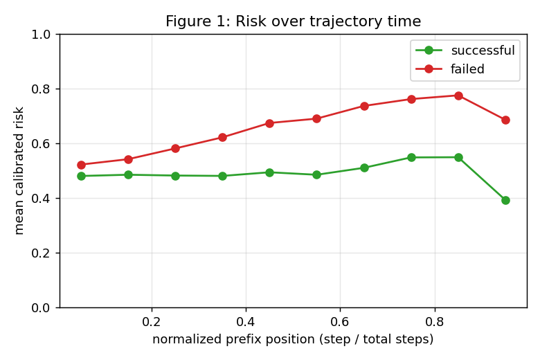
**Figure 1. Risk over trajectory time.** Calibrated failure risk vs. normalized prefix position:
it rises for eventually-failed runs (≈0.52→0.78) while staying flat (~0.5) for successful runs.
The signal accumulates over time; early prefixes are near-uninformative (the irreducible floor).

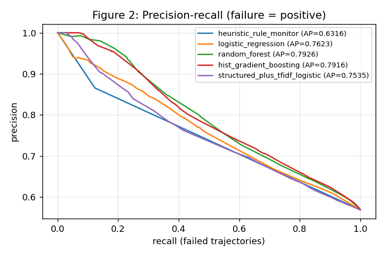
**Figure 2. Precision-recall (failure = positive).** The structured monitor vs. length-only and
heuristic baselines (with the local LLM-judge overlay). Cheap structured features dominate the
length-only and rule baselines.

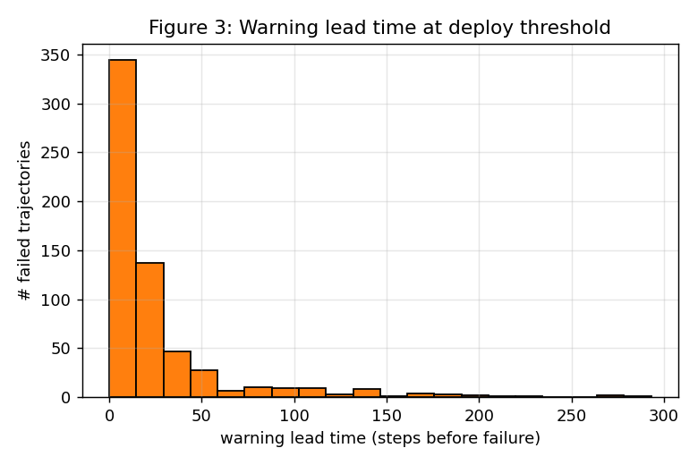
**Figure 3. Warning lead time.** Distribution of steps between the first alarm and the trajectory
end at the deploy threshold; median ≈ 13 steps.

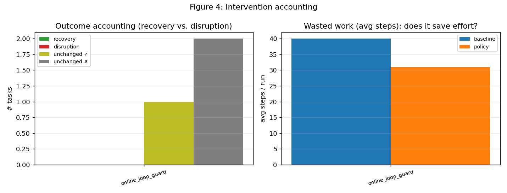
**Figure 4. Online intervention accounting.** Loop-guard vs. baseline: outcome changes (0
recoveries / 0 disruptions) and average steps (40→31). The low-disruption gate breaks nothing
while trimming wasted work (small-N, illustrative).

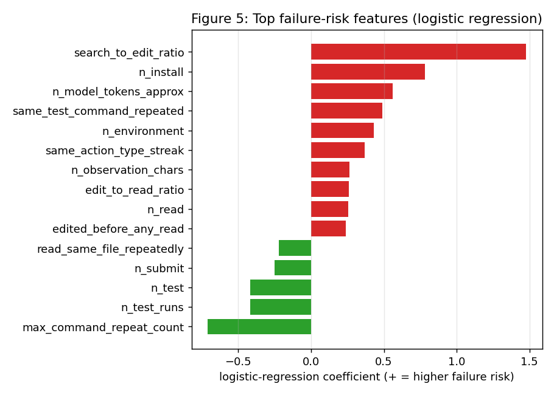
**Figure 5. Top failure-risk features** (logistic-regression coefficients). Repetition/looping
signals and a high search-to-edit ratio raise risk; running tests and submitting lower it:
"visible flailing" as the dominant signal.

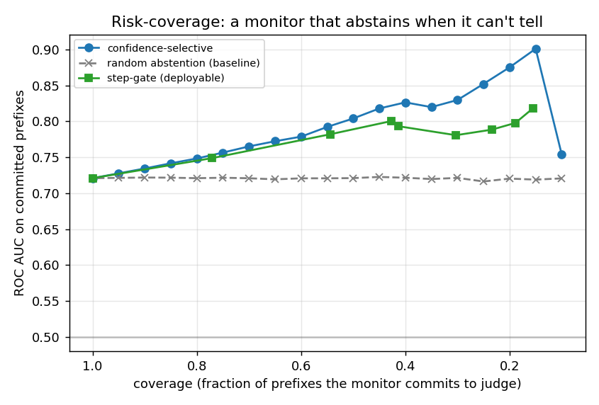
**Figure 6. Risk-coverage (selective prediction).** Confidence-selective AUC rises to 0.80 @ 50%
coverage / 0.83 @ 30%; a random-abstention control stays flat at 0.72 (the lift is real
selection), and a deployable step-gate is shown for comparison.

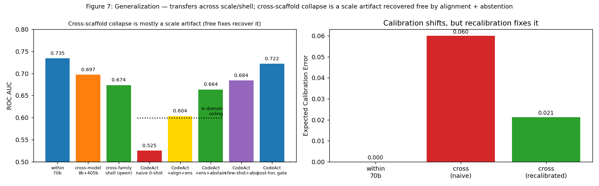
**Figure 7. Generalization.** (left) Transfer AUC across model scale, a shell-style scaffold, and
the cross-scaffold (CodeAct) collapse-then-free-recovery (naive 0.53 → +align+ensemble 0.60 →
+abstention 0.66), with the in-domain ceiling marked; (right) calibration shifts cross-
distribution but recalibration restores it (ECE 0.06→0.02).

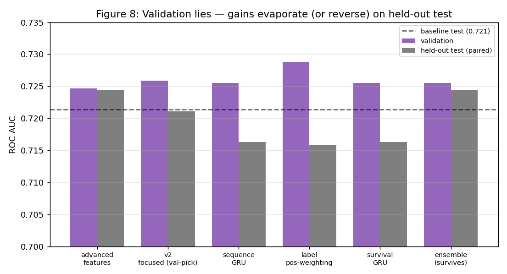
**Figure 8. "Validation lies."** Validation vs. paired instance-grouped held-out test AUC for five
candidate improvements: each won on validation but was no better (or worse) on held-out test;
only the ensemble survived, motivating the evaluation protocol (§5).

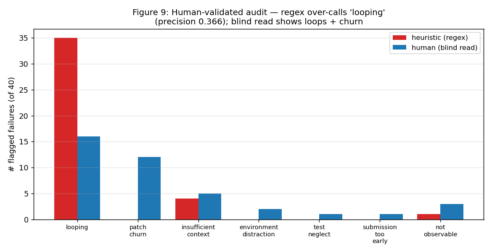
**Figure 9. Human-validated failure-mode audit** (50 blind-labeled prefixes). The regex labeler
over-calls "looping" (precision 0.37); blind human reading shows repetition + churn dominate the
confidently-caught failures.

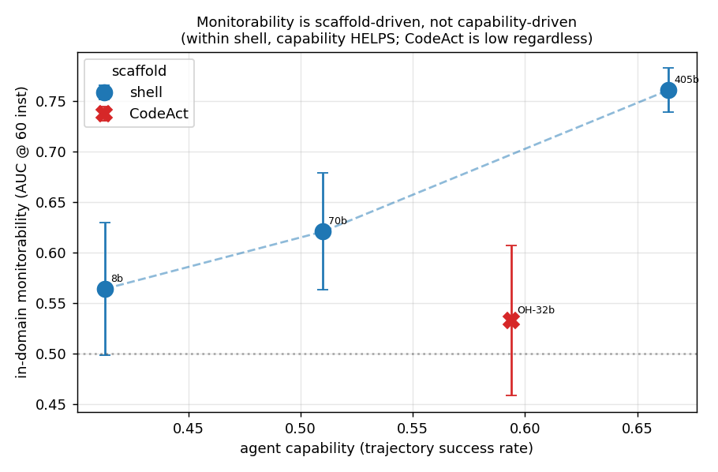
**Figure 10. Monitorability vs. capability, at matched data budget.** Within the shell scaffold,
monitorability *rises* with capability (8b→405b: 0.56→0.76); the CodeAct agent is the *least*
monitorable despite mid-high capability: monitorability is scaffold-driven, not capability-driven.

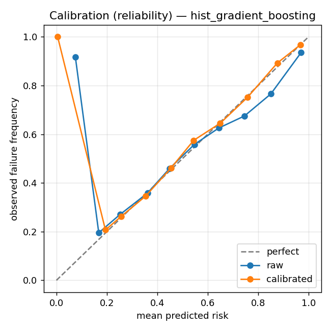
**Figure 11. Reliability diagram** for the deployed monitor, raw vs. isotonic-calibrated
(ECE 0.011).

## Reproducibility

All figures/tables regenerate from saved artifacts via
`python scripts/make_report.py --config configs/offline_full.yaml` (no retraining).
Key scripts: feature/label build and training under `scripts/`; generalization
(`run_generalization.py`) and the **second-source zero-shot test** (`ingest_openhands.py`
→ `build_prefix_dataset.py` → `run_second_source.py`, reusing the same feature pipeline);
abstention curves (`abstention.py`), online capture/replay
(`run_shadow_capture.py`, `run_monitor_replay.py`), human audit
(`build_audit_sample.py`, `score_audit.py`), deployment cost (`measure_cost.py`), and the
LLM-judge baselines (`run_openai_judge_subset.py --backend {openai,openrouter}`, reusing one
prompt/schema across `ollama_judge.py`, `openai_judge.py`, `openrouter_judge.py`).
Hardware: Apple M4 MacBook (10 cores, 32 GB RAM). **The monitor and all training/evaluation
are local (Ollama, CPU, no GPU); the LLM-judge baseline alone uses paid APIs** (OpenAI,
OpenRouter), pinned to dated model snapshots (`gpt-5.5-2026-04-23`,
`claude-opus-4.8 → claude-4.8-opus-20260528`) with per-call checkpointing. Test set scored
once; all deltas reported with paired instance-bootstrap CIs.
